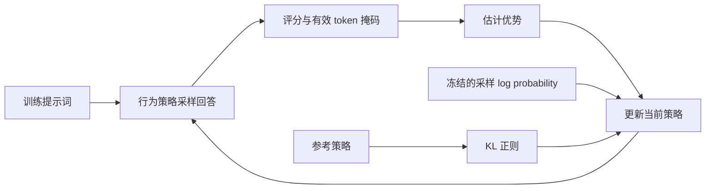

# 10 · 大模型后训练：PPO、GRPO、KL 与奖励设计

[返回全库](../README.md) · [策略梯度](../06_policy_gradient/) · [环境中的 PPO](../07_trpo_ppo/) · [数值演示](mechanism_demo.py) · [字符级实现](toy_rlhf.py)

**后训练中的 RL 改变的是模型生成回答的概率。** 模型先生成回答，奖励函数评估回答，再提高相对更好回答的概率。奖励通常不可微；梯度通过模型对已采样 token 的对数概率传播。

本章先建立环境 RL 与语言生成的对应，再解释一次更新的计算，最后联系奖励设计和 DPO。标准算法与玩具实现分开说明；这里没有大模型训练效果或算法排名的复现结论。

## 阅读路线：先追踪一次更新，再区分算法

假设模型要完成一道可自动判分的短题。先问四个问题：回答是谁生成的？好坏由谁判定？分数怎样传给各 token？优化器最终对哪个量求导？沿这条线，后训练就不再只是算法缩写列表。

| 遇到的问题 | 本章接下来怎样解决 | 阅读位置 |
|---|---|---|
| 只有终局分数，不知道中间动作比预期好多少 | 用价值预测与 GAE 构造优势 | 第 3 节 |
| 旧样本重复更新，策略可能偏离采样时的分布 | 用 old 比值和裁剪 surrogate 控制优化激励 | 第 3 节 |
| 不想额外训练价值模型 | 对同一道题生成一组回答，用相对奖励估计优势 | 第 4 节 |
| 高分回答逐渐偏离参考分布 | 明确参考 KL 加在哪里、如何估计 | 第 5–6 节 |
| 已有偏好对，能否直接训练 | 将偏好似然改写为策略概率比 | 第 7 节 |
| 公式懂了，却读不懂训练实现 | 跟随张量、梯度与源码入口逐步对照 | 第 8 节 |

先读第 1–4 节建立计算主线，再到第 8 节手算和运行；KL 与 DPO 的推导可在遇到对应问题时回读。

## 1. 从环境动作到生成 token

| 对象 | 经典环境 RL | 单轮语言模型 RL | 工具型 Agent |
|---|---|---|---|
| 状态 | 环境状态或观测历史 | 提示词与已生成前缀 | 对话、工具反馈与可见环境历史 |
| 动作 | 离散操作或连续控制量 | 下一个 token | 文本生成及工具调用 |
| 转移 | 环境决定，可随机 | 追加 token；给定动作后确定 | 工具执行与外部环境共同决定 |
| 奖励 | 即时或终局奖励 | 回答评分，也可有过程奖励 | 完成度、调用结果、成本等 |
| 数据 | 与环境交互的轨迹 | 提示词 → 采样回答 → 评分 | 多轮交互轨迹 |
| 初始化 | 可从随机策略开始 | 通常从预训练或 SFT 模型开始 | 通常从具备语言与工具能力的模型开始 |

整条回答作为一个动作，可得到上下文 bandit 表述；逐 token 建模则是有限回合 MDP。工具反馈不能用“只追加 token 的确定性转移”概括，部分可观测任务还需要历史或其他状态表示。

设提示词为 $`x`$，回答为 $`y=(y_1,\ldots,y_T)`$，长度 $`T`$ 包括实际生成的终止 token（若存在）。状态为 $`s_t=(x,y_{<t})`$，动作为 $`y_t`$，参数为 $`\theta`$：

```math
\pi_\theta(y\mid x)=\prod_{t=1}^T\pi_\theta(y_t\mid s_t),\qquad
\log\pi_\theta(y\mid x)=\sum_{t=1}^T\log\pi_\theta(y_t\mid s_t).
```

策略损失只覆盖回答的有效 token。提示词是条件，padding 不是动作；EOS 与达到最大长度的截断需要分别记录。有限长度无折扣任务可取 $`\gamma=1`$，这是对全库无限时域折扣记号的局部扩展。



## 2. 三个策略各做什么

| 记号 | 身份 | 更新期间的作用 |
|---|---|---|
| $`\pi_\theta`$ | 当前可训练策略 | 计算已采样回答的 log probability，接收梯度 |
| $`\pi_{\mathrm{old}}`$ | 本批数据的行为策略 | 提供冻结的采样概率；新一批 rollout 时刷新 |
| $`\pi_{\mathrm{ref}}`$ | 参考策略 | 提供分布偏离的参照；通常在一个训练阶段内固定 |

old 与 ref 可能初始相同，但用途不同。old 可以由已保存的 log probability 表示，不必另存完整模型。参考、奖励与价值模型的共享和卸载方式也影响显存，不能笼统说必须同时完整驻留四份模型。

若生成使用温度或截断采样，保存的行为概率必须对应实际采样分布。把变换后的样本直接当成未经变换策略的样本，会破坏重要性比值的解释。

## 3. PPO：从回报和价值预测到 token 优势

PPO 在这里同时处理两个问题：回报作为梯度权重可能噪声很大，因此引入价值基线；在旧数据上反复优化可能走得太远，因此引入裁剪目标。两件事分别发生在“优势计算”和“策略损失”，不要把 GAE 当成 clip 的一部分。

### 3.1 优势回答“比预期好多少”

设 $`r_t`$ 是生成 token 后的奖励，$`V_\phi(s_t)`$ 是价值模型预测的后续折扣回报。常见 PPO-RLHF 在终点加入标量回答奖励 $`R(x,y)`$，并以参考策略构造 token 级惩罚。在采样时冻结这些量：

```math
r_t=\mathbf 1_{t=T}R(x,y)-\beta\left[\log\pi_{\mathrm{old}}(y_t\mid s_t)-\log\pi_{\mathrm{ref}}(y_t\mid s_t)\right],\qquad\beta\ge0.
```

单个 log 比值可能为负，并不是逐点非负的 KL。InstructGPT 使用参考 SFT 策略的 KL 惩罚，还研究了混合预训练目标；此处只讲 RL 主路径。[InstructGPT，§3.1、§3.5](https://arxiv.org/html/2203.02155v1)

令真实终止状态价值为零，计算 TD 残差与广义优势估计（GAE）：

```math
\delta_t=r_t+\gamma V_\phi(s_{t+1})-V_\phi(s_t),\qquad
\hat A_t=\sum_{l=0}^{T-t}(\gamma\lambda)^l\delta_{t+l},\quad 0\le\lambda\le1.
```

时间限制导致的截断是否 bootstrap 取决于任务定义，不能都当成真实终止。更新 actor 时优势停止梯度；critic 拟合相应回报目标。终局奖励相同不意味着各 token 的 GAE 相同，因为前缀价值预测不同。

### 3.2 裁剪限制优化激励，不强制锁定概率

冻结旧概率，在旧样本上计算：

```math
\rho_t(\theta)=\exp\left[\log\pi_\theta(y_t\mid s_t)-\log\pi_{\mathrm{old}}(y_t\mid s_t)\right].
```

为避免长公式遮住计算结构，先定义裁剪函数和单个样本项：

```math
C_\epsilon(\rho)=\min(\max(\rho,1-\epsilon),1+\epsilon),\quad \epsilon>0.
```

```math
\ell(\rho,A)=\min(\rho A,C_\epsilon(\rho)A).
```

PPO 最大化采样平均（写成 loss 时取负号）：

```math
J_{\mathrm{clip}}=\mathbb{E}_t[\ell(\rho_t,\hat{A}_t)].
```

取 $`\epsilon=0.2`$：

| 优势 | 比值 | 未裁剪项 | 最终项 | 作用 |
|---|---|---|---|---|
| 2 | 1.4 | 2.8 | 2.4 | 不再奖励继续提高好动作概率 |
| -2 | 1.4 | -2.8 | -2.8 | 仍惩罚坏动作概率上升 |
| -2 | 0.6 | -1.2 | -1.6 | 不再奖励继续降低坏动作概率 |

clip 不是把所有概率强制锁在区间内，也不是对真实回报的单调改进保证；它是未裁剪 surrogate 的逐样本下界。[PPO，§3、§5](https://arxiv.org/pdf/1707.06347)

第一次更新前 $`\rho=1`$，**不意味着梯度为零**：分母冻结，分子仍可导。复用 rollout 做多次更新时，比值才可能进入裁剪区。监控比值、裁剪比例和相对 old 的 KL，才能知道裁剪是否实际发挥作用。

## 4. GRPO：同题回答之间比较

GRPO 改变了优势的来源：它用同题回答之间的比较替代学习的价值基线，但仍要处理当前策略相对 old 的变化。理解它时先看组怎么组成，再看奖励怎么标准化，最后才看 token 损失。

### 4.1 从一个组算起

给定同一 $`x`$，从 old 独立采样 $`G\ge2`$ 条回答 $`y_i`$，得奖励 $`R_i`$。本章数值演示采用总体标准差：

```math
\bar R=\frac1G\sum_iR_i,\qquad
\sigma_R=\sqrt{\frac1G\sum_i(R_i-\bar R)^2},\qquad
\hat A_i=\frac{R_i-\bar R}{\sigma_R+\eta},\quad\eta>0.
```

奖励 $`[1,0,1,0]`$ 的均值和标准差都是 $`0.5`$，优势近似 $`[1,-1,1,-1]`$。结果监督的 GRPO 将同一回答的优势分给所有有效 token；这不等于已经定位哪个推理步骤导致成功。

令 $`T_i`$ 为回答长度，$`\rho_{i,t}`$ 为当前/旧策略 token 比值，$`k_{i,t}`$ 为下一节的 KL 项。原始结果监督形式先在每条回答内平均，再对组平均：

```math
J_{\mathrm{GRPO}}=\mathbb{E}\left[\frac{1}{G}\sum_{i=1}^G\frac{1}{T_i}\sum_{t=1}^{T_i}\left(\ell(\rho_{i,t},\hat{A}_i)-\beta k_{i,t}\right)\right].
```

这里的期望对训练提示词及 old 策略生成的回答组取值，单样本函数沿用第 3 节的定义。

改成全批 token 平均会改变长短回答的相对权重，不是等价改写。去掉 critic 节省其开销，但组采样也消耗资源，不能直接推出总显存减半。GRPO 可用可验证奖励，也可用奖励模型；过程监督的优势定义不同。[DeepSeekMath，§4.1.1–4.1.3](https://arxiv.org/html/2402.03300v3#S4.SS1)

### 4.2 全对、全错与没有执行更新

奖励全相同则优势全零；二元奖励下全对、全错均如此。$`\eta`$ 只避免除零，不创造区分信号。此时奖励 surrogate 梯度为零，但 KL 或辅助项仍可能产生梯度，不能直接说整个模型不更新。

排查顺序：有效样本是否为空 → 奖励是否有组内差异 → actor 概率是否被错误 detach → loss 是否有计算图 → backward 与 optimizer.step 是否执行。重采样有差异的组可能提供信号，但会改变题目分布并增加成本，必须记录保留比例和采样预算。

### 4.3 组均值不能直接套“基线无偏”

以下是本章有限样本推导。对固定提示词，假设 $`G`$ 个回答独立同分布，奖励不显式依赖参数，采样策略就是求梯度的策略。令 $`g_i=\nabla_\theta\log\pi_\theta(y_i\mid x)`$。仅减组均值、不除标准差时：

```math
\mathbb{E}\left[\frac1G\sum_i(R_i-\bar R)g_i\right]
=\left(1-\frac1G\right)\mathbb{E}[Rg].
```

因为 $`\mathbb{E}[g_i]=0`$，不同样本的交叉项为零，而均值包含自身奖励 $`R_i/G`$。动作独立基线的无偏结论不能原样套用。leave-one-out 均值可去掉这里的缩放；再除随机标准差、做长度归一化或 clip 后，仍不能据此宣称整个 GRPO 估计无偏。

## 5. KL：方向、采样分布与归一化

固定前缀 $`s`$，设当前分布 $`p(a)=\pi_\theta(a\mid s)`$、参考分布 $`q(a)=\pi_{\mathrm{ref}}(a\mid s)`$，假设共同支持且概率为正：

```math
D_{\mathrm{KL}}(p\|q)=\sum_a p(a)\log\frac{p(a)}{q(a)}.
```

若 $`a\sim p`$，$`k_1=\log(p(a)/q(a))`$ 的期望为该 KL，但单点可为负。令 $`u=q(a)/p(a)`$，则

```math
k_3=u-\log u-1\ge0,\qquad\mathbb{E}_{a\sim p}[k_3]=D_{\mathrm{KL}}(p\|q).
```

等式来自 $`\mathbb{E}_p[u]=1`$；非负性来自 $`\log u\le u-1`$。演示用小型离散分布枚举核验。若样本来自不同 old 分布，未经校正的平均不再自动等于当前策略 KL。数值估计无偏也不等于在固定旧样本上直接反向，就获得原期望的完整梯度；还需分析采样分布随参数变化的项。

序列 log 比值是 token log 比值之和；序列 KL 还要对生成的前缀分布取期望。报告须注明整条回答总和、每回答 token 均值还是全批 token 均值。old 比值用于本轮更新，ref KL 用于参考分布约束；二者不能互相替代，KL 也不保证事实正确。

## 6. 奖励设计：先定义任务，再组合分数

RLHF 描述反馈来源，PPO、GRPO 描述优化方法。可验证奖励是否代表真实任务完成，取决于验证器的覆盖范围。

| 来源 | 输入 → 输出 | 主要失真 |
|---|---|---|
| 偏好奖励模型 | 提示词、回答 → 标量 | 标注偏好、长度偏好、分布外误判 |
| 答案或测试验证器 | 回答与标准答案/测试 → 得分 | 解析漏洞、测试覆盖不足、数据泄漏 |
| 格式奖励 | 回答 → 合规分 | 格式正确但任务失败 |
| 过程奖励 | 推理步骤及上下文 → 评分 | 局部合理、整体失败 |

数学任务可先规定独立校验正确率为主指标，再决定格式是解析条件还是附加小分。组合奖励必须记录分量、权重、版本和失败例子；不能只用总分上涨证明能力提高。改变奖励尺度，还要检查它与标准化、KL 系数和优化器的相互作用。

建议记录：独立评估正确率、奖励分量、组内标准差、零优势组比例、长度、截断率、KL 方向与单位、clip 比例、梯度范数和实际更新步数。比较方法还需对齐初始模型、数据划分、生成预算和评估采样方式。这些是待做实验的记录要求，不是本仓库已完成的大模型实验。

## 7. DPO：偏好学习的另一条路线

标准离线 DPO 使用固定偏好对 $`(x,y_w,y_l)`$，训练循环无需在线 rollout 或 critic；偏好数据的收集仍可能需要生成。

固定 $`x`$、固定奖励 $`R`$、$`\beta>0`$，考虑完整回答分布目标：

```math
F(\pi)=\mathbb{E}_{y\sim\pi}[R(x,y)]-\beta D_{\mathrm{KL}}(\pi\|\pi_{\mathrm{ref}}).
```

参考概率为正、配分函数有限时，定义

```math
Z(x)=\sum_y\pi_{\mathrm{ref}}(y\mid x)e^{R(x,y)/\beta},\qquad
\pi^{\star}(y\mid x)=\pi_{\mathrm{ref}}(y\mid x)e^{R(x,y)/\beta}/Z(x).
```

将 $`\log\pi^{\star}=\log\pi_{\mathrm{ref}}+R/\beta-\log Z`$ 代回，可得 $`F(\pi)=\beta\log Z-\beta D_{\mathrm{KL}}(\pi\|\pi^{\star})`$。因此最优完整分布为 $`\pi^{\star}`$；受限网络和有限数据不保证达到它。

反解 $`R=\beta\log(\pi^{\star}/\pi_{\mathrm{ref}})+\beta\log Z`$。Bradley–Terry 假设偏好概率为 $`\sigma(R_w-R_l)`$，同题的 $`\log Z`$ 在差中消去。用当前策略参数化，得到

```math
\mathcal L_{\mathrm{DPO}}=-\mathbb{E}_{(x,y_w,y_l)}\log\sigma\left[
\beta\log\frac{\pi_\theta(y_w\mid x)}{\pi_{\mathrm{ref}}(y_w\mid x)}
-\beta\log\frac{\pi_\theta(y_l\mid x)}{\pi_{\mathrm{ref}}(y_l\mid x)}\right].
```

$`\sigma`$ 是 logistic 函数。DPO 将偏好似然写成策略概率比，不等于 PPO，也不能据此判断谁在所有任务上更好。[DPO，§4、§5](https://arxiv.org/html/2305.18290v3)

## 8. 代码真正覆盖了什么

| 入口 | 实际覆盖 | 边界 |
|---|---|---|
| `mechanism_demo.py` | clip 斜率、同分组、KL 采样分布、组均值有限样本缩放 | 标准库确定性演示，不训练模型 |
| `toy_rlhf.py::run_ppo_rlhf` | RM、KL 整形、序列 REINFORCE 与批均值基线 | 旧函数名保留；没有 critic、GAE、多轮 PPO-clip，不是完整 PPO |
| `toy_rlhf.py::run_grpo` | 组内优势、token 比值、KL 与 mask | 同一 BOS 无条件生成；每个 rollout 仅更新一次，更新前比值为 1，不能验证 clip 激活后的作用 |
| `toy_rlhf.py::run_dpo` | 固定偏好对 DPO 损失 | 偏好由手写字符奖励产生，不是真实人类数据 |
| `toy_rlhf.py::evaluate` | 手写奖励均值、序列 log 比值均值 | 有限样本 KL 估计可为负，不证明大模型能力 |

旧玩具代码用 PyTorch 默认样本标准差，本章手算用总体标准差，有限组的尺度不同。旧代码注释中的历史命名和公式编号不作为完整性证据，定位以本节函数名为准。

从仓库根目录运行：

```bash
python 10_rlhf_dpo_grpo/mechanism_demo.py
```

演示枚举离散分布，并用有限差分检查斜率，成功末行是 `All mechanism checks passed.`。它不证明模型收敛。字符级实验仍可按原依赖运行 `python 10_rlhf_dpo_grpo/toy_rlhf.py`；本次专题更新未重跑其完整训练。

### 8.1 用三个 token 走完 GAE

只考虑一条真实终止的回答，暂时关闭 KL，取 $`\gamma=\lambda=1`$。三个有效 token 的奖励是 $`[0,0,1]`$，采样时冻结的价值预测是 $`[0.2,0.4,0.6]`$，终止后价值为 0。先从最后一步向前算：

| 位置 | 即时奖励 | 当前价值 | 下一状态价值 | TD 残差 | GAE 优势 | 回报目标：优势 + 价值 |
|---|---|---|---|---|---|---|
| 3 | 1 | 0.6 | 0 | 0.4 | 0.4 | 1 |
| 2 | 0 | 0.4 | 0.6 | 0.2 | 0.2 + 0.4 = 0.6 | 1 |
| 1 | 0 | 0.2 | 0.4 | 0.2 | 0.2 + 0.6 = 0.8 | 1 |

这说明终局评分不需要先平均分给三个 token：反向递推让早期动作包含未来回报。三个回报目标都是 1，但优势不同；在这个特定的无折扣、完整终止例子里，优势正好等于最终回报减去各前缀价值。

下面是本章自行写的标量教学实现，与 `mechanism_demo.py::gae_terminal` 对应。它省略批次、padding 和截断 bootstrap，不能原样用于生产训练。

```python
next_value, next_advantage = 0.0, 0.0
for t in reversed(range(len(rewards))):
    delta = rewards[t] + gamma * next_value - values[t]
    next_advantage = delta + gamma * lam * next_advantage
    advantages[t] = next_advantage
    next_value = values[t]
returns = [a + v for a, v in zip(advantages, values)]
```

actor 使用冻结优势；critic 拟合 `returns`。如果后续标准化优势，不能再用标准化后的优势加价值构造同一个回报目标。在本次核验的 verl 中，`returns` 正是在 `masked_whiten` 之前构造的。

### 8.2 从公式走向张量：输入、操作、输出

设 $`B`$ 是回答条数，$`T_{\max}`$ 是 padding 后回答长度。以下是单轮结果监督路径中的典型数据形状，不代表所有框架接口都相同。

| 步骤 | 输入 | 关键操作 | 输出及去向 |
|---|---|---|---|
| 评分 | B 条回答、验证器或 RM | 每条回答得到一个分数 | `[B]`，构造奖励或组内优势 |
| token 对齐 | 回答长度、终止位置 | 标记回答中的有效动作 | `response_mask: [B,T_max]` |
| PPO 优势 | 奖励与价值 `[B,T_max]` | 反向 GAE，构造回报目标 | actor 的优势、critic 的 targets |
| GRPO 优势 | `[B]` 分数与题目组 ID | 同题标准化，沿回答维广播 | `[B,T_max]`；不学习 critic |
| 概率比值 | 当前与 old 的 token log probability | 相减再指数化 | token 比值或进一步聚合的序列比值 |
| 策略损失 | 比值、冻结优势、mask | 裁剪、取负、按约定聚合 | 用于反向传播的标量 |

PPO 公式最大化 `min(unclipped, clipped)`，代码最小化它的负数，因此可以写成 `max(-unclipped, -clipped)`。看到 `maximum` 不能立即判断实现反了。真正要核对的是符号、输入优势、有效 token 和聚合方式。

同样，不能只看到 `detach()` 就判定没有梯度：old、奖励和优势通常应冻结，当前策略的 log probability 则必须保留计算图。先找“哪些量只是权重”，再找“梯度从哪个变量回到参数”。

### 8.3 为什么平均方式会改变训练

设回答 A 有 2 个有效 token，每个 token 的损失为 1；回答 B 有 4 个有效 token，每个 token 的损失为 3。这里损失是用于讲解的固定数值，不是训练结果。

| 聚合方式 | 本例计算 | 每条回答的总权重 |
|---|---|---|
| 全部有效 token 平均 | `(2×1 + 4×3)/6 = 7/3` | 随有效长度变化，B 是 A 的两倍 |
| 每回答先平均，再对回答平均 | `(1 + 3)/2 = 2` | 两条回答等权 |
| 每回答先求和，再对回答平均 | `(2 + 12)/2 = 7` | 随有效长度变化，同时整体尺度不同 |

padding 必须剔除。全局 token 平均和序列求和后平均，在固定批次里仅差一个总尺度，但该尺度会随批次长度变化；每回答先除自身长度还会改变样本之间的相对权重。分布式或梯度累积时，要追踪全局分母，不能把各微批均值无条件再平均。

### 8.4 阅读 verl：固定版本，按功能找入口

源码核验固定在 [verl 提交 6093e007](https://github.com/volcengine/verl/tree/6093e007cc341973c9d9a6fb3867a85976c7c458)，日期 2026-09-25。以下是阅读导航，不是本仓库已经运行过的分布式训练配置。

| 想弄清什么 | 固定版本入口 | 先检查什么 |
|---|---|---|
| GAE 怎样递推 | [compute_gae_advantage_return](https://github.com/volcengine/verl/blob/6093e007cc341973c9d9a6fb3867a85976c7c458/verl/trainer/ppo/core_algos.py#L216) | 终止初始化、mask、回报与白化顺序 |
| 同题组优势怎么构造 | [compute_grpo_outcome_advantage](https://github.com/volcengine/verl/blob/6093e007cc341973c9d9a6fb3867a85976c7c458/verl/trainer/ppo/core_algos.py#L268) | 组 ID、标准差约定、广播；本章假设 G≥2，源码有单样本组的特殊分支 |
| PPO 目标如何变成 loss | [compute_policy_loss_vanilla](https://github.com/volcengine/verl/blob/6093e007cc341973c9d9a6fb3867a85976c7c458/verl/trainer/ppo/core_algos.py#L1286) | 负号、双侧阈值；另有 dual-clip 与数值截断，不是只有原始 clip |
| 长短回答谁占比更高 | [agg_loss](https://github.com/volcengine/verl/blob/6093e007cc341973c9d9a6fb3867a85976c7c458/verl/trainer/ppo/core_algos.py#L1140) | mask、聚合模式和全局分母 |
| GSPO 改了哪一步 | [compute_policy_loss_gspo](https://github.com/volcengine/verl/blob/6093e007cc341973c9d9a6fb3867a85976c7c458/verl/trainer/ppo/core_algos.py#L1546) | 序列 log 比值、stop-gradient、聚合模式 |

函数名帮助理解职责，提交链接保证行号可复核。配置片段并不等于可运行实验；还要明确模型、数据、rollout、设备、依赖和日志，不能把“切换一个注册项”说成已经完成复现。

### 8.5 延伸：GSPO 改的是比值与裁剪粒度

GRPO 的结果监督优势已是序列级，但每个 token 仍使用自己的当前/旧策略比值。GSPO 保留组内优势，改用整条回答共享的长度归一化比值。沿用前文 $`\rho_{i,t}`$ 与 $`T_i`$，定义新量 $`s_i`$：

```math
s_i=\exp\left(\frac{1}{T_i}\sum_{t=1}^{T_i}\log\rho_{i,t}\right).
```

它是 token 比值的几何平均，而不是未经归一化的序列概率比。例子：两个 token 的比值为 1.6 和 0.625，乘积与几何平均都为 1。GRPO 仍看到两个不同的 token 比值；GSPO 对整条回答使用同一个 1，并在序列粒度决定裁剪。**共享比值为 1 不意味着梯度为零。** 长度归一化改变了权重定义，不能把它直接当成普通轨迹重要性采样的无偏校正。

在本次核验的源码中，`log_prob - log_prob.detach()` 前向为零，却保留当前 token 的梯度；再加上已冻结的序列平均 log 比值，使前向权重共享、梯度回到各 token。其与原序列目标的梯度对应，还依赖同一回答的优势相同和每回答 token 平均等条件；改变聚合方式会改变这个对应。[GSPO，§4.1–4.3](https://arxiv.org/html/2507.18071v2#S4)

该版本 verl 的 GSPO 已接受可配置的 `loss_agg_mode`，并非固定写死 `seq-mean-token-mean`；若希望对照原论文的每序列平均目标，必须明确选择相应模式。论文中的 MoE 稳定性结论有具体模型和训练条件，不能推广成所有 MoE 都必然更稳定。本仓库在这里提供机制阅读，没有新增 GSPO 训练实现或性能比较。

## 9. 自测与阅读出口

1. old 与 ref 为什么不能混用？——前者定义本批采样分布，后者定义正则参照。
2. 比值为 1 为什么还有梯度？——分母冻结，分子可导。
3. 全错组为何可能更新？——奖励优势为零不等于辅助项梯度为零。
4. GRPO 是否解决步骤级信用分配？——共享终局优势不定位步骤的因果贡献。
5. 非负 KL 项是否保证估计正确？——还须核对采样分布、方向和归一化。
6. 奖励上涨是否代表能力增强？——需要独立评估与失败案例支持。

练习：把混合奖励改成全对组，把 KL 权重从当前分布换成 old，再比较长短回答在两种平均方式下的权重。每次先预测，再运行解释。

## 原文与核验范围

- Schulman et al., *Proximal Policy Optimization Algorithms*（2017），§3、§5：[原文](https://arxiv.org/pdf/1707.06347)。
- Ouyang et al., *Training language models to follow instructions with human feedback*（2022），§3.1、§3.5：[原文](https://arxiv.org/html/2203.02155v1)。
- Shao et al., *DeepSeekMath: Pushing the Limits of Mathematical Reasoning in Open Language Models*（2024），§4.1：[原文](https://arxiv.org/html/2402.03300v3#S4.SS1)。
- Rafailov et al., *Direct Preference Optimization: Your Language Model is Secretly a Reward Model*（2023），§4、§5：[原文](https://arxiv.org/html/2305.18290v3)。

原文章节核验日期：2026-09-25。有限样本基线与离散 KL 分析是本章自行推导和检查；没有新增性能数字。

### 写法参考

讲解结构参考读者提供的《一文吃透 PPO / DPO / GRPO / GSPO：从公式推导到 verl 源码逐行拆解》（署名 Pulsar planet，公众号“Tim在路上”，2026-07-22）。借鉴其问题驱动与公式到代码的组织方式；本章例子、推导和文字自行编写，源码结论按上方固定版本核验。所提供打印件有缺失公式与裁切代码，不作为那些缺失内容的证据；未转载文章正文或 PDF。
