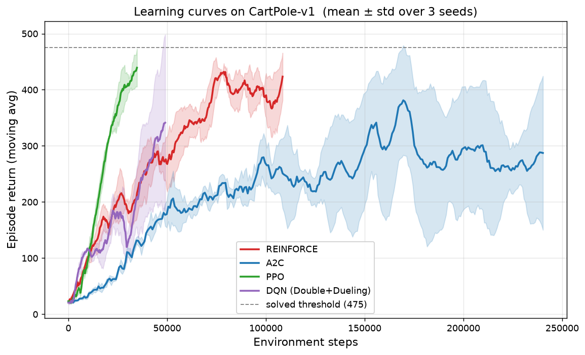
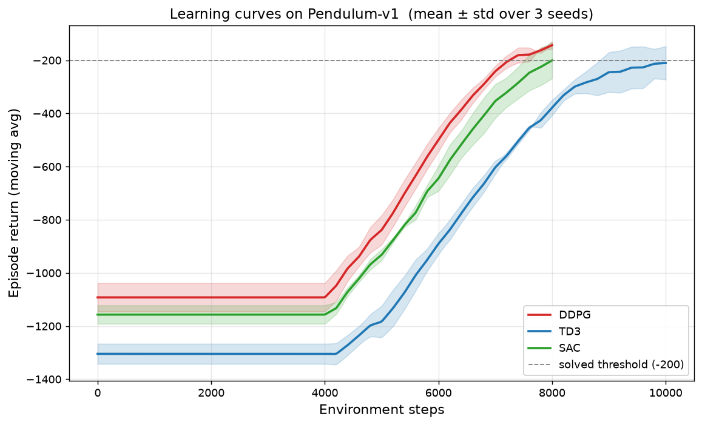

<div align="center">

# RL From Scratch · A Complete Reinforcement Learning Library

**Math Derivations + From-Scratch Implementations + Reproducible Experiments — All in One**

*From tabular methods all the way to RLHF and algorithmic trading, using numpy / PyTorch only.*

[](https://github.com/WonderfulClaire/rl-from-scratch/actions/workflows/ci.yml)
[](LICENSE)
[](https://www.python.org/)
[](https://pytorch.org/)
[](CONTRIBUTING.md)
[](https://github.com/WonderfulClaire/rl-from-scratch/stargazers)

[简体中文](README.md) · **English**

[Roadmap](#-roadmap) · [Results](#-results-real-runs) · [Quick Start](#-quick-start) · [Learning Path](#-learning-path) · [Papers](papers.md) · [Contributing](CONTRIBUTING.md)

</div>

---

## 💡 Why This Repository?

Most RL learning materials fall into two extremes:

> **Intuition-only, no derivation** — "PPO is just clipping," but you still don't understand where the objective comes from.
>
> **Equations-only, no working code** — Beautiful pseudocode on paper, but nothing converges when you actually implement it.

This repository ties three things together: **every line of code maps to a step in the derivation, and every formula is validated with real experiments.**

11 chapters covering the full spectrum of modern reinforcement learning — from tabular methods to RLHF and algorithmic trading.

---

## ✨ Key Features

### 🔢 Complete & Traceable Math Derivations
Every algorithm starts from the objective function and is derived step-by-step to the update rule. We explicitly mark where approximations happen and why they hold. No black boxes.

### 🛠️ Everything Implemented From Scratch
Tabular methods in pure NumPy; deep RL with only basic PyTorch operators — **no wrappers, no inheritance, no black-box libraries** like Stable-Baselines3. Every line of code corresponds to a specific equation in the derivation.

### 🧪 Honest, Reproducible Experiments
Every implementation is validated on standard Gymnasium environments. Learning curves come from **real runs with fixed seeds**. **Failure cases are reported honestly too** — e.g. in Chapter 11 the DQN trader underperforms buy-and-hold on the test split, a live demonstration of the backtest-overfitting trap.

### 📚 Structured 11-Chapter Curriculum
From MDP fundamentals to RLHF alignment, from single-agent to multi-agent, from discrete control to quantitative trading — not a random collection of algorithms, but a **complete learning path**.

---

## 🗺️ Roadmap

### Part I: Tabular Methods (NumPy)

| Chapter | Topic | Core Mathematics | Environment |
|:-------:|-------|------------------|-------------|
| [01](01_mdp_bellman/) | MDP & Bellman Equations | Markov Decision Processes, Bellman expectation/optimality equations, contraction mapping & fixed point | GridWorld (custom) |
| [02](02_dynamic_programming/) | Dynamic Programming | Policy evaluation, policy iteration, value iteration & convergence proofs | GridWorld |
| [03](03_monte_carlo_td/) | Monte Carlo & Temporal Difference | First-visit MC, TD(0), bias-variance tradeoff, n-step / TD(λ) | Random Walk |
| [04](04_sarsa_qlearning/) | SARSA & Q-Learning | On-policy vs off-policy, convergence conditions, maximization bias & Double Q | CliffWalking (custom) |

### Part II: Deep Value-Based Methods (PyTorch)

| Chapter | Topic | Core Mathematics | Environment |
|:-------:|-------|------------------|-------------|
| [05](05_dqn_family/) | DQN Family | Deadly triad, target networks, Double DQN overestimation analysis, Dueling decomposition, PER importance sampling | CartPole-v1 |

### Part III: Policy Optimization (PyTorch)

| Chapter | Topic | Core Mathematics | Environment |
|:-------:|-------|------------------|-------------|
| [06](06_policy_gradient/) | Policy Gradient: REINFORCE & A2C | Full policy gradient theorem proof, baseline invariance proof, GAE | CartPole-v1 |
| [07](07_trpo_ppo/) | TRPO & PPO | Performance difference lemma, monotonic improvement bound, trust region & natural gradient, PPO-clip lower bound | CartPole-v1 |
| [08](08_continuous_control/) | Continuous Control: DDPG / TD3 / SAC | Deterministic policy gradient theorem, TD3's three tricks, maximum-entropy RL & soft Bellman equation, reparameterization | Pendulum-v1 |

### Part IV: Frontiers & Applications

| Chapter | Topic | Core Mathematics | Environment |
|:-------:|-------|------------------|-------------|
| [09](09_multi_agent/) | Multi-Agent RL | Stochastic games, non-stationarity, CTDE paradigm, IPPO / MAPPO | Cooperative matrix game + multi-agent grid |
| [10](10_rlhf_dpo_grpo/) | RL in the LLM Era: RLHF / DPO / GRPO | Bradley-Terry model, closed-form optimal policy under KL constraint, full DPO derivation, GRPO group baseline | Toy character-level language model |
| [11](11_rl_for_trading/) | RL for Trading | Trading MDP modeling, position management, cost-aware reward design, backtest pitfalls | Custom trading environment (synthetic-style data) |

---

## 📊 Results (real runs)

> All plots below are from **real runs** of this repository's code, generated by [`tools/benchmark.py`](tools/benchmark.py): **mean ± std over 3 random seeds**, x-axis = real environment steps. Full numbers in [results/RESULTS.md](results/RESULTS.md).

### CartPole-v1: Four Mainstream Algorithms Head-to-Head



*Sample-efficiency comparison of REINFORCE / A2C / PPO / DQN on the same task — a visual answer to "why PPO is the default choice".*

### Pendulum-v1: Three Continuous-Control Algorithms



*Convergence speed & stability of DDPG / TD3 / SAC — TD3 and SAC are clearly more stable than DDPG.*

Reproduce:

```bash
python tools/benchmark.py --suite cartpole --seeds 3
python tools/benchmark.py --suite pendulum --seeds 3
```

---

## 🚀 Quick Start

### Requirements
- Python 3.10+
- PyTorch 2.0+ (tabular chapters need only NumPy)

### Three Steps to Your First Run

```bash
# 1. Clone the repo
git clone https://github.com/WonderfulClaire/rl-from-scratch.git
cd rl-from-scratch

# 2. Install dependencies
pip install -r requirements.txt

# 3. Run a demo (every chapter runs standalone)
python 05_dqn_family/dqn.py --double --dueling   # DQN family (stack --per too)
```

More demos:

```bash
python 02_dynamic_programming/dp_solvers.py    # policy iteration vs value iteration
python 07_trpo_ppo/ppo.py                      # PPO-clip
python 11_rl_for_trading/dqn_trader.py         # RL trading + backtest pitfalls

python tests/smoke_test.py                     # fast smoke tests (tabular chapters)
```

All demos are validated on **CPU** (finish in minutes) — no GPU required.

---

## 📁 Project Structure

```
rl-from-scratch/
├── 01_mdp_bellman/          # MDP & Bellman Equations
├── 02_dynamic_programming/  # Dynamic Programming
├── 03_monte_carlo_td/       # Monte Carlo & Temporal Difference
├── 04_sarsa_qlearning/      # SARSA & Q-Learning
├── 05_dqn_family/           # DQN Family (Double / Dueling / PER)
├── 06_policy_gradient/      # Policy Gradient (REINFORCE / A2C)
├── 07_trpo_ppo/             # TRPO & PPO
├── 08_continuous_control/   # Continuous Control (DDPG / TD3 / SAC)
├── 09_multi_agent/          # Multi-Agent RL (IPPO / MAPPO)
├── 10_rlhf_dpo_grpo/        # RLHF / DPO / GRPO
├── 11_rl_for_trading/       # RL for Algorithmic Trading
├── results/                 # Real experiment results & plots
├── tests/                   # Smoke tests
├── tools/                   # Benchmark tooling
├── papers.md                # Per-chapter paper reading list
├── notation.md              # Unified notation conventions
├── requirements.txt         # Dependencies
├── CONTRIBUTING.md          # Contributing guidelines
└── README_en.md             # This file
```

---

## 🛤️ Learning Path

- **Beginner**: 01 → 02 → 03 → 04 → 05 → 06 → 07 covers the backbone of modern RL.
- **For LLM / RLHF roles**: master the derivations in 06 & 07 (PPO is the heart of RLHF), then study 10.
- **For quant trading**: build foundations with 01-05, then study 11, focusing on reward design and the backtest-pitfalls section.
- **Just want the formulas**: each chapter's README derivation is self-contained.

Skim [notation.md](notation.md) first, then pair with [papers.md](papers.md) for the "README derivation → original paper motivation → this repo's code" loop.

---

## 🆚 Why This Library?

| Feature | This Repo | Stable-Baselines3 | Spinning Up | easy-rl |
|---------|:---------:|:-----------------:|:-----------:|:-------:|
| Full math derivations | ✅ | ❌ | ⚠️ Partial | ⚠️ Partial |
| Readable from-scratch code | ✅ | ❌ Heavily wrapped | ✅ | ✅ |
| Reproducible experiments | ✅ | ✅ | ✅ | ⚠️ |
| RLHF / DPO / GRPO coverage | ✅ | ❌ | ❌ | ❌ |
| Trading application | ✅ | ❌ | ❌ | ❌ |
| Chinese derivations & comments | ✅ | ❌ | ❌ | ✅ |

Differentiator: the combination of **RLHF / trading applications + complete bilingual derivations** is rare among existing RL learning resources.

---

## 🎯 Design Principles

1. **Code serves teaching**: single-file, framework-free, comments mapped to equation numbers; not optimized for production performance.
2. **No skipped steps**: every equals sign is either obvious or justified; approximations are explicitly marked.
3. **Honest experiments**: all learning curves come from real runs with fixed seeds; failure cases reported honestly.

---

## 🤝 Contributing

Contributions are welcome — bug fixes, derivation improvements, new algorithms, reproduction reports. Read [CONTRIBUTING.md](CONTRIBUTING.md) and submit a PR.

<a href="https://github.com/WonderfulClaire/rl-from-scratch/graphs/contributors">
  
</a>

---

## ⭐ Star History

[](https://star-history.com/#WonderfulClaire/rl-from-scratch&Date)

---

## 📄 License

[MIT](LICENSE) © WonderfulClaire

<div align="center">

**If this repository helps you, please ⭐ Star it to show your support!**

</div>
