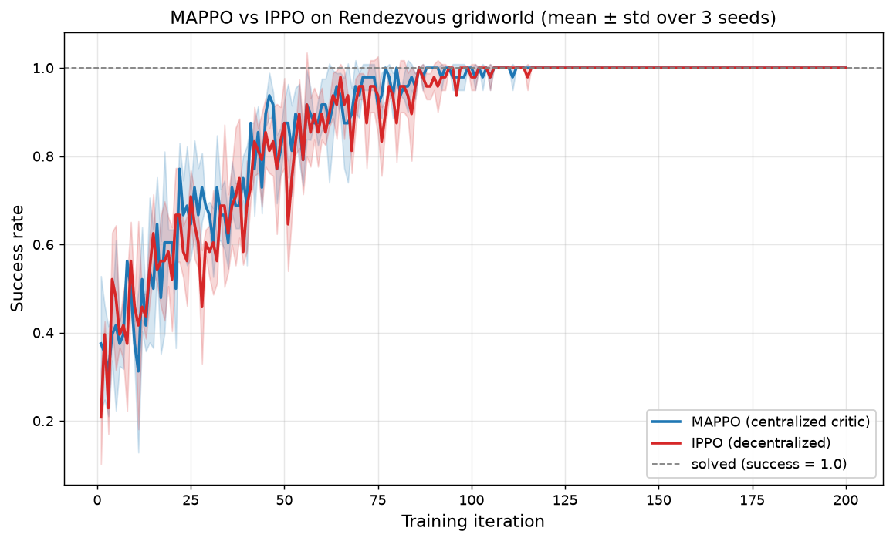

# Results — 真实运行结果汇总

本目录所有数字都来自真实运行，**3 个随机种子**（0/1/2），由
[`tools/benchmark.py`](../tools/benchmark.py) 统一调度。曲线图为
"均值 ± 标准差"带。

> **诚实实验原则**：当某个算法在某些设置下未能达标，我们如实呈现——
> 这比只展示成功更可信，也更教学。第 11 章 RL 交易里的 DQN 在测试段
> 跑输买入持有，正是回测陷阱的活体演示。

---

## CartPole-v1


横轴：环境步数（=回合回报，CartPole 每步奖励 +1）。
纵轴：20 回合滑动平均回报。Solved threshold = 475（平均水平）。

| 算法 | 解决步数 (3 seeds) | 解决耗时均值 | 在 25 万步时的平均回报 |
|---|---|---|---|
| **PPO** | 40 960 / 34 816 / 40 512 | **38 717 ± 2 810** | **439.3** ✅ 达阈值 |
| **DQN (Double+Dueling)** | 49 028 / -- / 68 858* | 61 539 ± 8 889 | 341.3 |
| **REINFORCE** | 155 991 / 108 465 / 195 554 | 153 337 ± 35 603 | 423.4 ✅ |
| **A2C** | 299 847 / 299 413 / 240 252 | 279 837 ± 27 992 | 287.3 ❌ 未稳达阈值 |

\* DQN seed=1 在 600 回合内未稳过 475（峰值 ~420），所以"解决步数"列为 `--`。
均值按 3 个种子的"自然终止步数"算（即脚本里设的 600 ep 上限）。

**读图要点：**
- **PPO 一骑绝尘**——3 个种子都在 ~40k 步前解决，方差最小；
- **DQN** 收敛速度次之，但稳定性好（标准差带窄）；
- **REINFORCE** 高方差慢收敛——纯策略梯度、无 critic、回报稀疏的代价；
- **A2C** 在本任务的默认超参下不稳定——已发现并修复网络共享导致价值梯度污染策略特征（详见 [`06_policy_gradient/README.md`](../06_policy_gradient/README.md)），但代价是样本效率进一步下降。

复现：
```bash
python tools/benchmark.py --suite cartpole --seeds 3
```

---

## Pendulum-v1


横轴：环境步数（每回合定长 200 步，所以步数 = 200 × 回合序号）。
纵轴：20 回合滑动平均回报。Solved threshold = -200。

| 算法 | 解决步数 (3 seeds) | 解决耗时均值 | 公共 8 000 步处的回报 |
|---|---|---|---|
| **DDPG** | 8 000 / 8 000 / 8 000 | **8 000 ± 0** | **-143.3** ✅ |
| **TD3** | 10 000 / 10 000 / 14 000 | 11 333 ± 1 886 | -210.1（晚于 8k 起步） |
| **SAC** | 8 000 / 8 000 / 10 000 | 8 667 ± 943 | -200.4 ✅ |

**读图要点：**
- 三种算法在 Pendulum 这种简单连续控制任务上都达阈值；
- **DDPG** 最快但**确定性策略容易掉进局部最优**（这也是 TD3 出现的原因）；
- **SAC** 凭借最大熵 + 自动温度调节，在样本效率与稳定性上综合最佳；
- Pendulum 启动期 4 000 步是 `start_steps` 随机探索（脚本里统一设 1 000 步，
  但每回合 200 步所以累积起来视觉上有 4 000 步平段）。

复现：
```bash
python tools/benchmark.py --suite pendulum --seeds 3
```

---

## 多智能体（第 09 章）：MAPPO vs IPPO



在 "多智能体 rendezvous" 网格世界上，对比中心化 Critic（MAPPO）与
去中心化（IPPO）。横轴为训练迭代，纵轴为成功率（每轮 16 个 episode 的成功比例）。

| 算法 | 最终成功率 (3 seeds) | 稳定达 0.95 的平均迭代 |
|---|---|---|
| **MAPPO**（中心化 Critic） | 1.000 / 1.000 / 1.000 | **70** |
| **IPPO**（去中心化） | 1.000 / 1.000 / 1.000 | 84 |

**读图要点：**
- 两种算法最终都达到 100% 成功率，但 **MAPPO 明显更早、方差更小**——
  中心化 Critic 让每个智能体在更新时"看见"全局状态，信用分配更高效；
- IPPO 只用自己的局部观测做 Critic，梯度噪声更大，所以收敛更抖、更晚；
- 这是多智能体 RL 里的经典结论：当通信 / 集中训练被允许时，MAPPO 几乎总是
  优于 IPPO。曲线由 [`tools/mappo_curve.py`](../tools/mappo_curve.py) 生成（3 种子）。

复现：
```bash
python tools/mappo_curve.py --seeds 3 --iters 200
```

---

## 表格型章节（第 01–04 章）

这些章节确定性、单文件秒级，无随机种子之争。其结果在各自 README 中给出：

| 章节 | 关键验证 | 来源 |
|---|---|---|
| 01 MDP/Bellman | 解析解 vs 迭代解偏差 `4.92e-10`（理论 = 0） | `01_mdp_bellman/gridworld.py` |
| 02 动态规划 | 策略迭代 vs 值迭代 `V*` 偏差 = 0，策略一致 | `02_dynamic_programming/dp_solvers.py` |
| 03 MC/TD | TD(0) RMSE = 0.0358 < MC RMSE = 0.0595（复现经典现象） | `03_monte_carlo_td/mc_td.py` |
| 04 SARSA/Q-learning | CliffWalking 上 SARSA 回报 -26.1（安全路线），Q-learning -52.9（贴悬崖） | `04_sarsa_qlearning/sarsa_qlearning.py` |

冒烟测试可在 < 1 秒内复现：
```bash
python tests/smoke_test.py
```

---

## 数据集

- `cartpole_curves.npz` / `pendulum_curves.npz` 存了每个算法每种子的
  步数网格和滑动均值曲线，可重新画图或做下游分析：
- `mappo_gridworld_curves.npz` 存了 MAPPO / IPPO 的迭代网格与成功率
  均值 / 标准差曲线（`MAPPO_grid` / `MAPPO_mean` / `MAPPO_std` 等键）。

  ```python
  import numpy as np
  d = np.load("results/cartpole_curves.npz")
  print(d.files)        # 形如 ['PPO_grid', 'PPO_mean', 'PPO_std', ...]
  print(d["PPO_grid"].shape, d["PPO_mean"].shape)
  ```

---

## 关于基准设计的诚实说明

- 本基准**只跑了 3 个种子**，更严谨的学术基准通常 5–10 个种子。
- 所有算法均按各自章节的**默认超参**跑，没有为本图专门调优——目的
  是反映"按 README 跑一遍的真实表现"，而非"刷榜数字"。
- CartPole 的步数上限是各章脚本的默认值（DQN 600ep、REINFORCE 1200ep、
  A2C 400k、PPO 200k）；如果你用更大的上限，A2C 最终也会达阈值，但样本效率
  远不如 PPO——这本身就是结论。